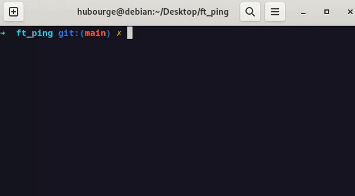
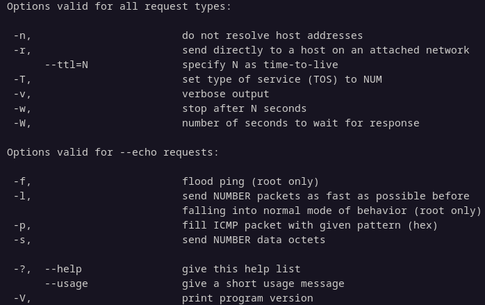
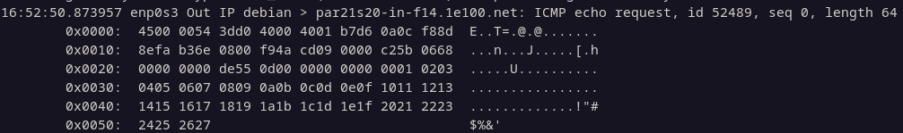

# ft_ping

42 project - recode ping command

## 🛰️ Clone project
```sh
git clone git@github.com:hugo-bourgeon/ft_ping.git
cd ft_ping/
sudo ./ft_ping --help
sudo ./ft_ping localhost
```

## 📑 Introduction

**Ping** is the name of a command that allows to test the accessibility of another machine
through the IP network. The command measures also the time taken to receive a response,
called round-trip time.



## 📌 Objectives  
- Understand low-level network layers (IP & ICMP).  
- Work with raw sockets.  
- Build and parse network headers (IP & ICMP).  
- Implement the core features of the ping command.  

## ⚙️ Features  
- Sends ICMP Echo Requests  
- Handles Echo Reply and Time Exceeded responses
- Measures round-trip time (RTT)  
- Displays packet stats: sent, received, lost, min/avg/max RTT



## 🧬 ICMP Echo Request Analize

Raw ICMP Echo Request packet example (84 bytes):

```sh
ping google.com
```

Analize network with: ```sudo tcpdump -i any icmp -X```  




---

### IPv4 Header (20 bytes)

| Offset | Hex Value   | Field                    | Description                                                      |
|--------|-------------|--------------------------|------------------------------------------------------------------|
| 0x00   | 45          | Version & IHL            | IPv4 and header length.                                          |
| 0x01   | 00          | Type of Service          | Priority and routing preferences.                                |
| 0x02   | 0054        | Total Length             | Total size of the IP packet (header + data).                     |
| 0x04   | 3dd0        | Identification           | Identifies fragments of a datagram.                              |
| 0x06   | 4000        | Flags & Fragment Offset  | Controls and identifies packet fragmentation.                    |
| 0x08   | 40          | Time To Live             | Maximum number of hops before discard.                           |
| 0x09   | 01          | Protocol                 | Protocol of the data (1 = ICMP).                                 |
| 0x0A   | b7d6        | Header Checksum          | Error-checking for the IP header.                                |
| 0x0C   | 0a0cf88d    | Source Address           | IP address of the sender.                                        |
| 0x10   | 8efab36e    | Destination Address      | IP address of the receiver.                                      |

---

### ICMP Header (8 bytes)

| Offset | Hex Value | Field            | Description                                      |
|--------|-----------|------------------|--------------------------------------------------|
| 0x14   | 08        | Type             | Message type (8 = Echo Request).                 |
| 0x15   | 00        | Code             | Subtype (0 for Echo Request).                    |
| 0x16   | f94a      | Checksum         | Error-checking for header and payload.           |
| 0x18   | cd09      | Identifier       | Matches requests with replies.                   |
| 0x1A   | 0000      | Sequence Number  | Incremented with each Echo Request.  

---

### Payload (56 bytes)

The payload contains arbitrary data, often a pattern or timestamp, for round-trip time or integrity checks.

```
                              c25b 0668 
0000 0000 de55 0d00 0000 0000 0001 0203
040 50607 0809 0a0b 0c0d 0e0f 1011 1213
1415 1617 1819 1a1b 1c1d 1e1f 2021 2223
2425 2627  
```

## 📑 Documentation

[man ping](https://www.man-linux-magique.net/man8/ping.html)  
[man ICMP](https://man7.org/linux/man-pages/man7/icmp.7.html)  
[RCF 792 ICMP](https://www.rfc-editor.org/rfc/rfc792.html)  
[man ip_icmp.h](https://sites.uclouvain.be/SystInfo/usr/include/netinet/ip_icmp.h.html)  
[man sockaddr](https://man7.org/linux/man-pages/man3/sockaddr.3type.html)  